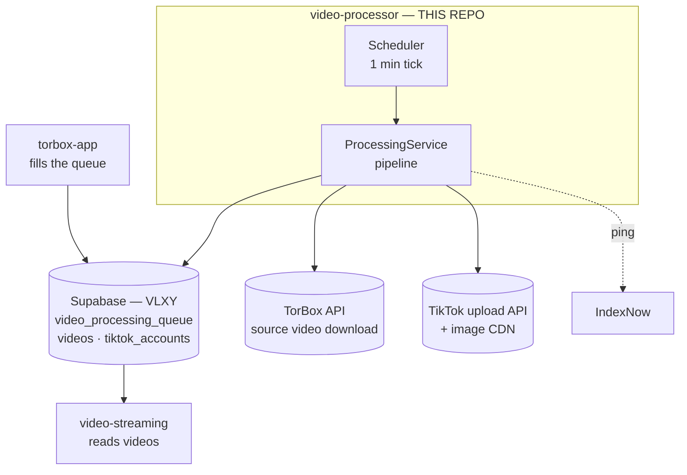

# 01 — System Context

Covers the role of `video-processor` in the wider three-service pipeline and defines every
external boundary the worker touches.

---

## Purpose

`video-processor` is a **long-running, poll-based Node.js worker** — not a web server and
not an end-user product. It is the middle stage of a three-service pipeline that shares a
single Supabase project:

1. **torbox-app** (upstream) adds torrent/file references to `video_processing_queue`.
2. **video-processor (this repo)** claims queue rows, runs the full
   download → transcode → PNG steganography → TikTok-upload pipeline, and writes the
   finished `videos` row.
3. **video-streaming** (downstream) reads `videos` and streams content to end-users.

Entry point: [`src/index.ts`](../../src/index.ts) — boots `App`, which starts a
`Scheduler` (every 1 minute) that drives `ProcessingService.processNextVideo()`.
Scheduler logic: [`src/services/scheduler.ts`](../../src/services/scheduler.ts).

---

## C4-style Context Diagram

---

## System Boundary Table

### External services

| System | What it is | How this app interacts |
|---|---|---|
| **Supabase** (service-role key) | Shared Postgres backend; RLS bypassed — see [`src/config/supabase.ts`](../../src/config/supabase.ts) | **Reads/claims** `video_processing_queue` rows (atomic `queued → processing` flip, ordered by `index`); **writes** `videos` rows (`hls_playlist_url`, status `ready`/`failed`); **reads and updates** `tiktok_accounts` (credentials, cooldown status) |
| **TorBox API** | BitTorrent-as-a-service that issues temporary signed download URLs for cached torrent files | `TorboxService.requestDownloadUrl(torrent_id, file_id)` fetches a short-lived URL that the pipeline streams from; authenticated via `TORBOX_TOKEN` env var |
| **TikTok upload API + image CDN** | TikTok's internal upload endpoint (`api/upload/image/`) and CDN (`p16-sg.tiktokcdn.com`) | `TiktokUploadOrchestrator` POSTs PNG-wrapped HLS segment files and the playlist; collects returned CDN URIs; the final playlist CDN URL is stored in `videos.hls_playlist_url` |
| **IndexNow** | SEO search-index ping protocol | `IndexNowService.submitVideo()` is called after each successful `videos` row is written; a fire-and-forget HTTP ping |

### Sibling apps

| App | What it is | Relationship |
|---|---|---|
| **torbox-app** | Upstream producer service | Populates `video_processing_queue` with `torrent_id`, `file_id`, and an `index` priority value; this app never writes to that table's source data |
| **video-streaming** | Public-facing Nuxt 4 frontend | Reads the `videos` table written by this app and serves HLS streams to end-users; the two apps share the same Supabase project but have no direct runtime coupling |

---

## What This App Does NOT Do

- **No web server / inbound HTTP** — there is no Express server or HTTP listener at
  runtime (despite Express appearing in legacy Cursor rules; `src/index.ts` confirms this).
- **Does not fill the queue** — `torbox-app` is the sole writer of
  `video_processing_queue` rows.
- **Does not read `videos` back** — once a `videos` row is written it is handed off to
  `video-streaming`; this worker does not query `videos` for reading.
- **Does not serve content to end-users** — all user-facing delivery is handled by
  `video-streaming`.
- **Does not perform hardware detection at runtime** — the `EncodingStrategyFactory`
  always returns `NvidiaEncodingStrategy`; the README's "automatic hardware detection"
  claim does not match the code (see CLAUDE.md and `src/services/encoding/`).

---

## Cross-links

- Pipeline internals (Scheduler → ProcessingService, 6-step flow, concurrency guards):
  [02-worker-and-pipeline.md](./02-worker-and-pipeline.md)
- Database tables, Zod schemas, ER diagram:
  [05-data-model.md](./05-data-model.md)
