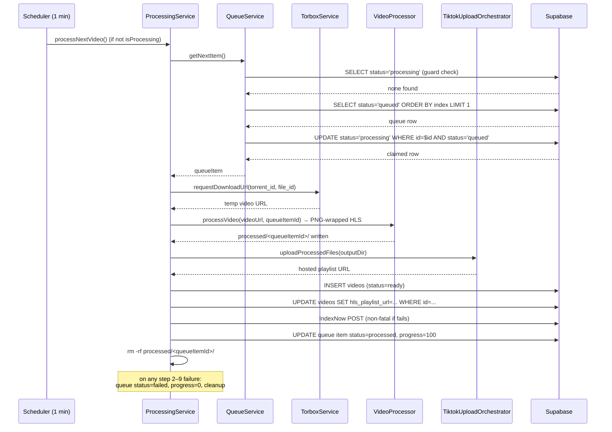

# Worker Architecture and Processing Pipeline

Covers the runtime shape of the application, the control-flow from scheduler tick to queue claim, the full 9-step processing pipeline implemented in `ProcessingService`, and an inventory of every service under `src/services/`.

Source files referenced throughout:
- [`src/index.ts`](../../src/index.ts)
- [`src/services/scheduler.ts`](../../src/services/scheduler.ts)
- [`src/services/processingService.ts`](../../src/services/processingService.ts)
- [`src/services/queueService.ts`](../../src/services/queueService.ts)
- [`src/services/torboxService.ts`](../../src/services/torboxService.ts)
- [`src/services/videoService.ts`](../../src/services/videoService.ts)
- [`src/services/indexNowService.ts`](../../src/services/indexNowService.ts)
- [`src/services/apiClientService.ts`](../../src/services/apiClientService.ts)

---

## 1. App Shape

This is a **long-running poll-based worker**, not a web server. There are no HTTP listeners; the process stays alive indefinitely, ticking on a fixed interval to drain the `video_processing_queue` table in Supabase.

> **Stale `package.json` description:** `package.json` describes the app as one that "monitors a folder for videos and pushes them to a Supabase queue". That is incorrect. The app **consumes** the queue — it reads `video_processing_queue` rows that were inserted by an external producer, then runs the full download-transcode-upload pipeline on each one.

Boot sequence (`src/index.ts`):

1. `App` constructor creates a `Scheduler(1)` (1-minute interval).
2. `App.initialize()` verifies the Supabase connection.
3. `App.start()` calls `scheduler.start()`.
4. Graceful shutdown on `SIGINT`/`SIGTERM` calls `scheduler.stop()`.

---

## 2. Control Flow and Concurrency

```
setInterval (1 min)
  └─ Scheduler.runTask()
       guard: isProcessing == false
       └─ ProcessingService.processNextVideo()
            └─ QueueService.getNextItem()
                 guard: no row with status='processing'
                 claim: UPDATE status='queued'→'processing' WHERE status='queued'
```

### Two-layer concurrency guard

| Layer | Mechanism | Scope |
|---|---|---|
| In-process | `Scheduler.isProcessing` flag | Prevents the 1-min tick from firing a second `processNextVideo()` if the previous one is still running |
| Cross-instance | `QueueService.getNextItem()` refuses if any row has `status='processing'`; then does a conditional `UPDATE … WHERE status='queued'` to atomically claim the row | Prevents two worker instances from picking up the same item simultaneously |

The conditional UPDATE (`WHERE id = $id AND status = 'queued'`) is the race-free claim: if a concurrent instance already flipped the row to `processing`, the UPDATE matches zero rows and the second instance backs off.

Queue items are ordered by the `index` column (ascending), so the oldest-enqueued item is always processed first.

---

## 3. The Processing Pipeline

`ProcessingService.processNextVideo()` runs a **9-step pipeline**. Each step is timed and logged; the timing breakdown is written to the log on both success and failure.

> **Note:** the task brief described a 6-step pipeline, but the code contains 9 numbered steps. Steps 5 and 6 are a distinct INSERT then UPDATE; step 7 is IndexNow; step 8 marks the queue item processed; step 9 is cleanup.

### Step 1 — Claim queue item

```
queueService.getNextItem()
```

Returns the lowest-`index` row with `status='queued'`, atomically updating it to `status='processing'`. Returns `null` if the queue is empty or another item is already processing, in which case the pipeline exits immediately.

### Step 2 — Fetch temporary download URL

```
torboxService.requestDownloadUrl(queueItem.torrent_id, queueItem.file_id)
```

Calls the TorBox API (`torrents.requestDownloadLink`) with the torrent and file IDs stored in the queue row. Returns a short-lived direct download URL for the raw video file.

### Step 3 — Transcode to PNG-wrapped HLS

```
videoProcessor.processVideo(videoUrl, queueItem.id)
  → output: processed/<queueItemId>/
```

Downloads the video from the TorBox URL and runs it through a multi-stage FFmpeg pipeline that produces PNG-steganography-wrapped HLS segments. Output lands in `processed/<queueItemId>/` relative to `process.cwd()`. See [`03-video-processing-png-steganography.md`](./03-video-processing-png-steganography.md) for internals.

### Step 4 — Upload segments to TikTok

```
tiktokUploadOrchestrator.uploadProcessedFiles(outputDir)
  → returns: hosted playlist URL (string)
```

Reads all PNG files from the output directory, distributes batch uploads across active TikTok accounts from the `tiktok_accounts` Supabase table, retries on failure (up to 3 attempts with exponential back-off). Returns the publicly hosted M3U8 playlist URL. See [`04-tiktok-upload.md`](./04-tiktok-upload.md) for internals.

### Step 5 — INSERT `videos` row

```
videoService.createVideo({ …queueItem fields, id: queueItem.id })
```

Inserts a row into the `videos` table with `status: 'ready'` (hardcoded at insert time). Also finds-or-creates related `actresses` and `video_networks` records and wires up the M2M join rows.

### Step 6 — UPDATE `videos` row with playlist URL

```
videoService.updateVideoStatus(video.id, 'ready', tiktokPlaylistUrl)
```

Updates the newly created `videos` row to set `hls_playlist_url` to the URL returned by step 4. Status remains `'ready'`.

### Step 7 — Submit to IndexNow

```
indexNowService.submitVideo(video.id)
```

POSTs the canonical video URL (`https://<INDEXNOW_HOST>/video/<id>`) to `https://api.indexnow.org/IndexNow`. Failure is **non-fatal** — logged as an error but does not throw, so the pipeline continues.

### Step 8 — Mark queue item processed

```
queueService.updateStatus(queueItem.id, 'processed', 100)
```

Sets `status='processed'` and `progress=100` on the queue row.

### Step 9 — Delete output folder

```
cleanupOutputFolder(outputDir)   // fs.rm(outputDir, { recursive: true, force: true })
```

Removes the `processed/<queueItemId>/` directory to reclaim disk space.

### Failure path

If any step in steps 2–9 throws, the `catch` block:
1. Sets queue item to `status='failed', progress=0`.
2. Deletes the output folder.
3. Re-throws the error (Scheduler catches and logs it; `isProcessing` resets in `finally`).

---

## 4. Pipeline Sequence Diagram



---

## 5. Service Inventory

| File | Class | Responsibility |
|---|---|---|
| `scheduler.ts` | `Scheduler` | Drives the 1-minute poll loop; holds `isProcessing` flag to prevent overlapping runs |
| `processingService.ts` | `ProcessingService` | Orchestrates the 9-step download→transcode→upload pipeline for one queue item |
| `queueService.ts` | `QueueService` | CRUD for `video_processing_queue`; implements cross-instance atomic claim via conditional UPDATE |
| `torboxService.ts` | `TorboxService` | Calls the TorBox API to resolve a `(torrent_id, file_id)` pair to a temporary download URL |
| `videoProcessor.ts` | `VideoProcessor` | FFmpeg transcoding pipeline: HLS segmentation → metadata strip → PNG steganography embedding |
| `videoService.ts` | `VideoService` | Inserts and updates `videos` rows; find-or-creates related `actresses` and `video_networks` |
| `tiktokUploadOrchestrator.ts` | `TiktokUploadOrchestrator` | Batch-uploads PNG segment files across TikTok accounts with retry/back-off; returns playlist URL |
| `tiktok/TiktokUploadService.ts` | `TiktokUploadService` | Low-level multipart POST to the TikTok CDN endpoint via `ApiClientService` |
| `tiktokAccountService.ts` | `TiktokAccountService` | Fetches active TikTok accounts from Supabase, ordered by `last_upload_at` for load distribution |
| `apiClientService.ts` | `ApiClientService` | Thin Axios wrapper (get/post/put/patch/delete) with cookie and header helpers; used by TikTok upload |
| `indexNowService.ts` | `IndexNowService` | POSTs video URLs to `api.indexnow.org` for search-engine crawl notification (non-fatal on error) |
| `encoding/EncodingStrategy.ts` | `EncodingStrategy` | Interface contract for FFmpeg encoding strategies |
| `encoding/EncodingStrategyFactory.ts` | `EncodingStrategyFactory` | Intended to pick a hardware accelerator, but `createStrategy()` currently **always returns `NvidiaEncodingStrategy('p1')`** — detection is stubbed (see [`03-video-processing-png-steganography.md`](./03-video-processing-png-steganography.md)) |
| `encoding/NvidiaEncodingStrategy.ts` | `NvidiaEncodingStrategy` | NVENC-accelerated H.264 encoding strategy |
| `encoding/AmdEncodingStrategy.ts` | `AmdEncodingStrategy` | AMF-accelerated H.264 encoding strategy |
| `encoding/IntelQsvEncodingStrategy.ts` | `IntelQsvEncodingStrategy` | Intel Quick Sync Video encoding strategy |
| `encoding/AppleVideoToolboxEncodingStrategy.ts` | `AppleVideoToolboxEncodingStrategy` | Apple VideoToolbox (macOS) encoding strategy |
| `encoding/CpuEncodingStrategy.ts` | `CpuEncodingStrategy` | Software (libx264) CPU fallback encoding strategy |
