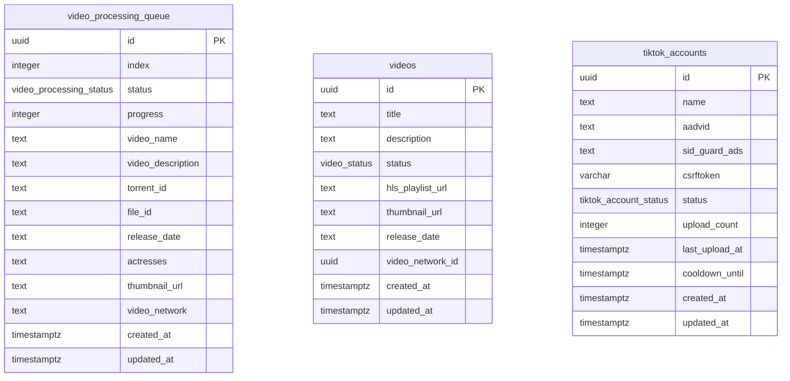

# 05 — Data Model

Covers the three tables owned by the video-processor worker (`video_processing_queue`, `videos`, `tiktok_accounts`), their columns and enum types, the migration history that shaped them, and their relationships.

Source files:
- [`src/config/supabase.ts`](../../src/config/supabase.ts) — client instantiation
- [`src/types/index.ts`](../../src/types/index.ts) — Zod schemas and derived TS types
- [`src/types/database.ts`](../../src/types/database.ts) — generated DB types
- [`supabase/migrations/`](../../supabase/migrations/) — DDL history

---

## 1. Access Pattern

The worker uses a **service-role** Supabase client (`SUPABASE_SECRET_KEY`), created once in `src/config/supabase.ts`:

```ts
createClient(envConfig.SUPABASE_URL, envConfig.SUPABASE_SECRET_KEY, {
  auth: { autoRefreshToken: false, persistSession: false },
})
```

Using the service-role key bypasses all RLS policies; no per-user JWT is needed. The client is exported as a singleton and consumed exclusively through service classes — business logic never imports or calls `supabase` directly.

Every row written or read is validated against a Zod schema defined in `src/types/index.ts`:

| Schema | Table |
|---|---|
| `VideoProcessingQueueItemSchema` | `video_processing_queue` |
| `VideoSchema` | `videos` |
| `TiktokAccountSchema` | `tiktok_accounts` |

Application-level types (`VideoProcessingQueueItem`, `Video`, `TiktokAccount`) are derived via `z.infer<typeof ...Schema>`. Database enum types (`VideoProcessingStatus`, `VideoStatus`, `TiktokAccountStatus`) are aliased from the generated types in `src/types/database.ts` via `Database['public']['Enums'][...]`.

---

## 2. Tables

### `video_processing_queue`

Work queue — one row per video pending or in-flight processing.

| Column | Type | Nullable | Notes |
|---|---|---|---|
| `id` | `uuid` | NOT NULL | PK, default `gen_random_uuid()` |
| `index` | `integer` | NOT NULL | Processing order; Zod enforces `>= -2`; negative values (`-1`, `-2`) signal elevated priority |
| `status` | `video_processing_status` | NOT NULL | Default `'queued'` |
| `progress` | `integer` | NOT NULL | 0–100; default `0`; CHECK constraint enforced in DB |
| `video_name` | `text` | nullable | Display name for the video |
| `video_description` | `text` | nullable | Description passed to TikTok |
| `torrent_id` | `text` | nullable | TorBox torrent ID used to resolve download URL |
| `file_id` | `text` | nullable | TorBox file ID used to resolve download URL |
| `release_date` | `text` | nullable | ISO date string |
| `actresses` | `text` | nullable | Comma-separated actress names |
| `thumbnail_url` | `text` | nullable | Pre-resolved thumbnail |
| `video_network` | `text` | nullable | Network/studio label |
| `created_at` | `timestamptz` | nullable | Auto-set on insert |
| `updated_at` | `timestamptz` | nullable | Auto-updated via trigger |

> `video_path` (originally a `NOT NULL UNIQUE TEXT` column) was removed in migration `006` after `torrent_id`/`file_id` superseded it.

---

### `videos`

Published video records consumed by the streaming front-end.

| Column | Type | Nullable | Notes |
|---|---|---|---|
| `id` | `uuid` | NOT NULL | PK, default `gen_random_uuid()` |
| `title` | `text` | NOT NULL | |
| `description` | `text` | nullable | |
| `status` | `video_status` | nullable | Default `'ready'` (set in migration `003`) |
| `hls_playlist_url` | `text` | nullable | HLS `.m3u8` URL served to the player |
| `thumbnail_url` | `text` | nullable | |
| `release_date` | `text` | nullable | |
| `video_network_id` | `uuid` | nullable | FK → `video_networks.id` |
| `created_at` | `timestamptz` | nullable | |
| `updated_at` | `timestamptz` | nullable | |

---

### `tiktok_accounts`

TikTok upload credentials and rate-limit bookkeeping.

| Column | Type | Nullable | Notes |
|---|---|---|---|
| `id` | `uuid` | NOT NULL | PK |
| `name` | `text` | NOT NULL | Human-readable label |
| `aadvid` | `text` | NOT NULL | TikTok device ID cookie |
| `sid_guard_ads` | `text` | NOT NULL | TikTok session cookie |
| `csrftoken` | `varchar(255)` | nullable | Added in migration `004`; used for API auth |
| `status` | `tiktok_account_status` | nullable | Default `'active'` |
| `upload_count` | `integer` | nullable | Cumulative upload counter |
| `last_upload_at` | `timestamptz` | nullable | Timestamp of most recent upload |
| `cooldown_until` | `timestamptz` | nullable | Worker skips account if `NOW() < cooldown_until` |
| `created_at` | `timestamptz` | nullable | |
| `updated_at` | `timestamptz` | nullable | |

---

## 3. Enums

All three enum types live in the `public` schema and are defined in migration `003` (and reflected in `src/types/database.ts`).

### `video_processing_status`

| Value | Meaning |
|---|---|
| `queued` | Awaiting pickup by worker |
| `processing` | Worker is actively processing |
| `processed` | Successfully completed |
| `failed` | Unrecoverable error |

### `video_status`

| Value | Meaning |
|---|---|
| `uploaded` | Raw upload received (Zod-only; pre-migration `003` legacy value) |
| `pending` | Awaiting processing (Zod schema; current DB enum did not include `pending` at migration `003` time) |
| `processing` | HLS transcode in progress |
| `ready` | HLS stream available |
| `failed` | Processing error |

> **Note:** Migration `003` created the DB enum with only `('ready', 'processing', 'failed')`, but `database.ts` (regenerated after later schema edits) and `VideoSchema` both include `'uploaded'` and `'pending'`. The generated types are authoritative for the live DB; see `database.ts` `video_status` enum definition.

### `tiktok_account_status`

| Value | Meaning |
|---|---|
| `active` | Account is eligible for uploads |
| `limited` | Temporarily rate-limited or restricted |
| `inactive` | Disabled; worker skips entirely |

---

## 4. Migrations

| File | What it does |
|---|---|
| `001_create_video_queue_table.sql` | Creates `video_processing_status` enum and the `video_processing_queue` table with `id`, `video_path` (UNIQUE NOT NULL), `index`, `status`, `progress`, `created_at`, `updated_at`; adds indexes; enables RLS with an allow-all policy; installs `update_updated_at_column` trigger. |
| `002_add_status_progress_columns.sql` | Idempotent guard: re-creates the `video_processing_status` enum if absent and adds `status`/`progress` columns to `video_processing_queue` if they don't already exist (handles environments where `001` was not run). |
| `003_convert_status_to_enums.sql` | Creates `tiktok_account_status` (`active`, `limited`, `inactive`) and `video_status` (`ready`, `processing`, `failed`) enums; replaces the existing varchar `status` columns on `tiktok_accounts` and `videos` with the new enum columns; sets `videos.status` default to `'ready'`; adds status indexes on both tables. |
| `004_add_csrf_token_column.sql` | Adds `csrftoken VARCHAR(255)` (nullable) to `tiktok_accounts` with an index. |
| `005_add_torrent_file_id_columns.sql` | Adds nullable `torrent_id TEXT` and `file_id TEXT` columns to `video_processing_queue` for TorBox integration; adds indexes on both. |
| `006_remove_video_path_column.sql` | Drops the unique constraint, index, and `video_path` column from `video_processing_queue` — this field is fully superseded by `torrent_id`/`file_id`. |

---

## 5. ER Diagram



**Relationships:** There are **no database-level foreign keys** between these three tables. `video_processing_queue.torrent_id` and `video_processing_queue.file_id` are plain `TEXT` references to TorBox external identifiers — not DB FKs. `videos.video_network_id` carries a FK to `video_networks.id` (defined in the shared schema, not managed by this worker's migrations). The worker correlates queue entries to `videos` rows by application logic, not by DB constraint.
