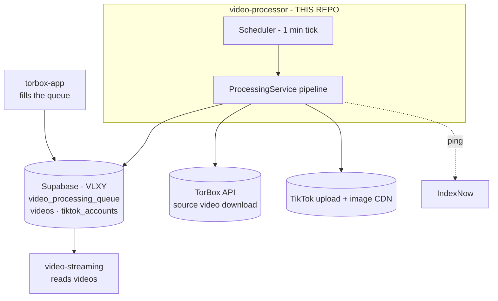
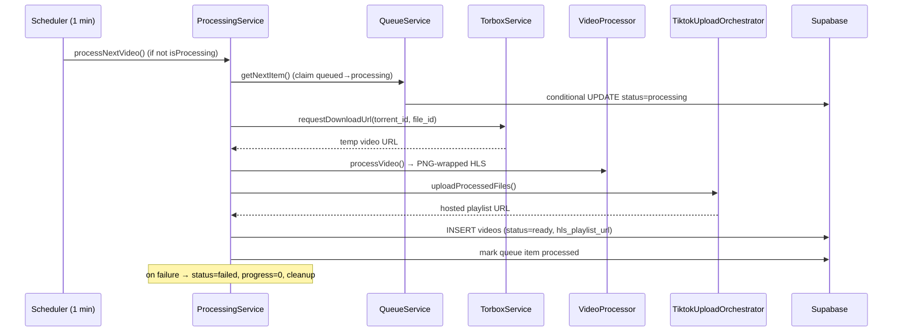
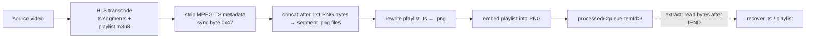

# video-processor Architecture Documentation Implementation Plan

> **For agentic workers:** REQUIRED SUB-SKILL: Use superpowers:subagent-driven-development (recommended) or superpowers:executing-plans to implement this plan task-by-task. Steps use checkbox (`- [ ]`) syntax for tracking.

**Goal:** Produce a focused set of architecture reference docs under `docs/architecture/` so humans and AI agents understand the TikTok video-processor — a poll-based worker that turns Supabase queue items into HLS-in-PNG videos hosted on TikTok's image CDN — and how it bridges torbox-app and video-streaming.

**Architecture:** One Markdown file per concern plus a `README.md` index. Each doc is grounded in current code (read the cited source before writing — never guess), uses scannable tables, and embeds Mermaid diagrams. The existing `CLAUDE.md` and `.claude/memory/` are linked, not duplicated. Code is the source of truth — flag known doc/code mismatches.

**Tech Stack:** TypeScript (strict, Zod-first) · Node poll-based worker · pnpm · @supabase/supabase-js (service-role) · fluent-ffmpeg · sharp · @torbox/torbox-api · winston · axios.

**Spec:** `docs/superpowers/specs/2026-06-09-architecture-documentation-design.md`

---

## How verification works in this plan

No test runner for prose. Each task ends with real shell checks:

- Doc exists: `test -f <doc>`
- No placeholders: `grep -nE 'TODO|TBD|FIXME|PLACEHOLDER|XXX' <doc>` → expect **no output**
- Cited paths resolve (final task): a loop running `test -e` on backticked paths.

The writer MUST open and read the listed source files before writing each doc. Accuracy comes from reading the code, not from this plan restating it.

## Known code/doc mismatches to flag (verify, then state in the relevant doc)

- `EncodingStrategyFactory.createStrategy()` always returns `NvidiaEncodingStrategy('p1')` — hardware detection is stubbed; README's "automatic hardware detection" is aspirational; the `videoProcessor` CPU-fallback re-creates the same NVENC strategy (no real fallback). → doc 03.
- `package.json` `description` ("monitors a folder … pushes to a queue") is stale — the app *consumes* the queue. → doc 02 (or README).

## File structure (what gets created)

```
docs/architecture/
  README.md                                  # index + reading order + link to CLAUDE.md
  01-system-context.md                       # bridge role + external deps (C4 diagram)
  02-worker-and-pipeline.md                  # poll worker, scheduler, 6-step pipeline (sequence diagram)
  03-video-processing-png-steganography.md   # KEYSTONE: HLS→PNG embed/extract + encoding strategies
  04-tiktok-upload.md                        # orchestrator/service: CDN upload, batching, account rotation
  05-data-model.md                           # 3 tables, Zod schemas, migrations (ER diagram)
  06-config-and-ops.md                       # env vars, logging, heap/gc flags, IndexNow, commands
```

Each doc is independent; Tasks 2–7 can run in any order after Task 1. Recommended order: Task 1 → Task 8.

---

### Task 1: Scaffold the folder and the README index

**Files:** Create `docs/architecture/README.md`

- [ ] **Step 1: Write the index**

Write `docs/architecture/README.md` with:

1. **What this app is** — one paragraph: a long-running TypeScript poll-based worker (`tiktok-video-uploader`, git remote `video-processor`) that consumes the shared Supabase `video_processing_queue`, downloads via TorBox, transcodes to HLS, hides segments in PNGs, uploads to TikTok's image CDN, and writes the published `videos` row.
2. **How it fits the bigger system** — short paragraph + bullets: it is the **bridge** — `torbox-app` fills `video_processing_queue`; this app processes + uploads; `video-streaming` reads `videos`. External: TorBox API, TikTok image-CDN/upload API, Supabase (service-role), IndexNow.
3. **Document index** — table linking the 6 docs (relative links) with one-line descriptions:
   - `01-system-context.md` — bridge role + external deps; C4 diagram.
   - `02-worker-and-pipeline.md` — poll worker, scheduler, the 6-step pipeline; sequence diagram.
   - `03-video-processing-png-steganography.md` — keystone: HLS→PNG steganography + encoding strategies.
   - `04-tiktok-upload.md` — orchestrator/service: CDN upload, batching, account rotation, retries.
   - `05-data-model.md` — 3 Supabase tables, Zod schemas, migrations; ER diagram.
   - `06-config-and-ops.md` — env vars, logging, heap/gc flags, IndexNow, commands.
4. **Reading order** — newcomer: 01 → 02 → 03 (keystone) → 04 → 05 → 06.
5. **Relationship to CLAUDE.md** — note that [`CLAUDE.md`](../../CLAUDE.md) is the concise working guide; these docs are the deeper, diagrammed reference and follow the **code** where docs diverge.

Use relative links like `[01-system-context.md](./01-system-context.md)`.

- [ ] **Step 2: Verify**

```bash
cd /home/nguyenhaison/upload-to-tiktok
test -f docs/architecture/README.md && grep -nE 'TODO|TBD|FIXME|PLACEHOLDER|XXX' docs/architecture/README.md; echo "done"
```

- [ ] **Step 3: Commit**

```bash
cd /home/nguyenhaison/upload-to-tiktok
git add docs/architecture/README.md
git commit -m "docs(arch): add architecture docs folder + index"
```

---

### Task 2: System context (`01-system-context.md`)

**Files:** Create `docs/architecture/01-system-context.md`
- Read first: `CLAUDE.md`, `src/index.ts`, `src/config/index.ts`, `src/config/supabase.ts`, `src/services/scheduler.ts`, `README.md`, `env.example`.

- [ ] **Step 1: Write the doc**

Required content (open with a one-line "what this covers"; link source files by path):

1. **Purpose paragraph** — the bridge/middle stage: consumes the queue, produces `videos`; not a web server, a long-running worker.
2. **C4-style context diagram** (Mermaid). Start from this skeleton, refine labels as needed:



3. **System boundary table** — for each external part (Supabase, TorBox API, TikTok upload/CDN, IndexNow) and each sibling app (torbox-app, video-streaming): what it is and how THIS app interacts with it. For Supabase, note it reads/claims `video_processing_queue`, writes `videos`, reads/updates `tiktok_accounts` (service-role key, RLS bypassed).
4. **What this app does NOT do** — no UI, no end-user serving, doesn't fill the queue (torbox-app does), doesn't read `videos` back.
5. **Cross-links** — `02-worker-and-pipeline.md`, `05-data-model.md`.

- [ ] **Step 2: Verify**

```bash
cd /home/nguyenhaison/upload-to-tiktok
test -f docs/architecture/01-system-context.md && grep -nE 'TODO|TBD|FIXME|PLACEHOLDER|XXX' docs/architecture/01-system-context.md; echo done
echo "fences: $(grep -c '```' docs/architecture/01-system-context.md)"
```

- [ ] **Step 3: Commit**

```bash
cd /home/nguyenhaison/upload-to-tiktok
git add docs/architecture/01-system-context.md
git commit -m "docs(arch): system context + external boundaries"
```

---

### Task 3: Worker & pipeline (`02-worker-and-pipeline.md`)

**Files:** Create `docs/architecture/02-worker-and-pipeline.md`
- Read first: `src/index.ts`, `src/services/scheduler.ts`, `src/services/processingService.ts`, `src/services/queueService.ts`, `src/services/torboxService.ts`, `src/services/videoService.ts`, `src/services/indexNowService.ts`, `src/services/apiClientService.ts`. Skim the other services for the inventory table.

- [ ] **Step 1: Write the doc**

Required content:

1. **App shape** — long-running poll-based worker (not a web server). `src/index.ts` boots an `App` that starts a `Scheduler`. Note `package.json` `description` is stale (says folder-monitor/producer; it actually consumes the queue) — flag this.
2. **Control flow & concurrency** — `Scheduler` (1-min tick, `src/services/scheduler.ts`) → `ProcessingService.processNextVideo()`. Two single-video concurrency guards: scheduler `isProcessing` flag; `QueueService.getNextItem()` refuses if any row is `processing`, then atomically flips `queued→processing` (conditional update) to avoid cross-instance races.
3. **The 6-step pipeline** (`processNextVideo`) — confirm against code and document:
   1. Claim next queue item (ordered by `index`).
   2. `TorboxService.requestDownloadUrl(torrent_id, file_id)` → temporary video URL.
   3. `VideoProcessor.processVideo()` → PNG-wrapped HLS in `processed/<queueItemId>/` (link `03-video-processing-png-steganography.md`).
   4. `TiktokUploadOrchestrator.uploadProcessedFiles()` → hosted playlist URL (link `04-tiktok-upload.md`).
   5. Create `videos` row, status `ready` with playlist URL.
   6. `IndexNowService.submitVideo()`, mark queue item `processed`, delete output folder.
   On any failure: queue item → `failed`, progress `0`, output folder cleaned up.
4. **Pipeline sequence diagram** (Mermaid):



5. **Service inventory** — table of `src/services/*` (scheduler, processingService, queueService, torboxService, videoProcessor, videoService, tiktokUploadOrchestrator, tiktok/TiktokUploadService, tiktokAccountService, apiClientService, indexNowService, encoding/*) with a one-line responsibility each.

- [ ] **Step 2: Verify**

```bash
cd /home/nguyenhaison/upload-to-tiktok
test -f docs/architecture/02-worker-and-pipeline.md && grep -nE 'TODO|TBD|FIXME|PLACEHOLDER|XXX' docs/architecture/02-worker-and-pipeline.md; echo done
ls src/services
```
Expected: doc exists; no placeholders; every top-level service appears in the inventory.

- [ ] **Step 3: Commit**

```bash
cd /home/nguyenhaison/upload-to-tiktok
git add docs/architecture/02-worker-and-pipeline.md
git commit -m "docs(arch): poll worker + processing pipeline"
```

---

### Task 4: Video processing & PNG steganography — KEYSTONE (`03-video-processing-png-steganography.md`)

**Files:** Create `docs/architecture/03-video-processing-png-steganography.md`
- Read first (depth focus — quote key code): `src/services/videoProcessor.ts`, `src/services/encoding/EncodingStrategy.ts`, `EncodingStrategyFactory.ts`, `NvidiaEncodingStrategy.ts`, `CpuEncodingStrategy.ts` (and skim the AMD/Apple/Intel strategies), and the extract side in `src/services/tiktokUploadOrchestrator.ts`.

- [ ] **Step 1: Write the doc**

Required content:

1. **Why** — the point of the project: host video segments on TikTok's **image** CDN by disguising HLS files as PNGs.
2. **Transcode → embed steps** (`videoProcessor.ts`), confirm against code:
   1. Transcode source to HLS (`.ts` segments + `playlist.m3u8`), ~5s segments targeting <5MB.
   2. Strip FFmpeg metadata packet from each `.ts` (byte-surgery on MPEG-TS sync byte `0x47`).
   3. Concatenate each `.ts` (and the playlist) **after** a 1×1 PNG's bytes → valid-looking `.png`. Extraction reads everything after the PNG `IEND` chunk.
   4. Rewrite playlist `.ts` references to `.png`; embed the playlist into a PNG too.
3. **Embed/extract diagram** (Mermaid):



4. **The PNG↔payload boundary** — the `IEND` signature `49 45 4E 44 AE 42 60 82` must stay consistent between the writer (`videoProcessor.ts`) and the reader (`tiktokUploadOrchestrator.ts`). State this explicitly.
5. **Encoding strategies** — Strategy + Factory over NVIDIA/AMD/Apple/Intel-QSV/CPU (`src/services/encoding/`). **Flag the reality:** `EncodingStrategyFactory.createStrategy()` currently always returns `NvidiaEncodingStrategy('p1')` — hardware detection is stubbed; the `videoProcessor` CPU-fallback `try/catch` re-creates the same NVENC strategy, so it does not actually fall back. The README's "automatic hardware detection" does not match the code.

- [ ] **Step 2: Verify**

```bash
cd /home/nguyenhaison/upload-to-tiktok
test -f docs/architecture/03-video-processing-png-steganography.md && grep -nE 'TODO|TBD|FIXME|PLACEHOLDER|XXX' docs/architecture/03-video-processing-png-steganography.md; echo done
echo "fences: $(grep -c '```' docs/architecture/03-video-processing-png-steganography.md)"
```

- [ ] **Step 3: Commit**

```bash
cd /home/nguyenhaison/upload-to-tiktok
git add docs/architecture/03-video-processing-png-steganography.md
git commit -m "docs(arch): video processing + HLS-in-PNG steganography (keystone)"
```

---

### Task 5: TikTok upload (`04-tiktok-upload.md`)

**Files:** Create `docs/architecture/04-tiktok-upload.md`
- Read first: `src/services/tiktokUploadOrchestrator.ts`, `src/services/tiktok/TiktokUploadService.ts`, `src/services/tiktokAccountService.ts`, `src/services/apiClientService.ts`.

- [ ] **Step 1: Write the doc**

Required content:

1. **Upload flow** — the orchestrator uploads each segment PNG to `api/upload/image/`, collects returned CDN URIs, rewrites the playlist PNG's segment lines to those absolute CDN URLs, re-embeds, and uploads the final playlist. The hosted playlist PNG URL is stored in `videos.hls_playlist_url`.
2. **Batching** — `TIKTOK_BATCH_SIZE` / `TIKTOK_BATCH_DELAY_MS`; uploads distributed round-robin across active accounts.
3. **Retry resilience** — `TiktokUploadService` retries 5xx/timeout with exponential backoff + jitter per file; the orchestrator retries whole failed files on rotated accounts.
4. **Account management** — `TiktokAccountService`: accounts have `aadvid`, `sid_guard_ads`, `csrftoken`; a `403` marks the account `limited` with a 24h cooldown. Active-account selection.
5. **API client** — `apiClientService` role (auth headers/cookies, base endpoint `TIKTOK_API_ENDPOINT`).

- [ ] **Step 2: Verify**

```bash
cd /home/nguyenhaison/upload-to-tiktok
test -f docs/architecture/04-tiktok-upload.md && grep -nE 'TODO|TBD|FIXME|PLACEHOLDER|XXX' docs/architecture/04-tiktok-upload.md; echo done
```

- [ ] **Step 3: Commit**

```bash
cd /home/nguyenhaison/upload-to-tiktok
git add docs/architecture/04-tiktok-upload.md
git commit -m "docs(arch): TikTok upload orchestration + account rotation"
```

---

### Task 6: Data model (`05-data-model.md`)

**Files:** Create `docs/architecture/05-data-model.md`
- Read first: `src/types/index.ts` (Zod schemas), `src/types/database.ts` (generated types), `src/config/supabase.ts`, and ALL six files in `supabase/migrations/`.

- [ ] **Step 1: Write the doc**

Required content:

1. **Access pattern** — Supabase service-role client (`src/config/supabase.ts`, RLS bypassed); tables are only touched through service classes, never raw clients in business logic; all rows validated through Zod schemas in `src/types/index.ts` (`VideoProcessingQueueItemSchema`, `VideoSchema`, `TiktokAccountSchema`), TS types via `z.infer`; generated DB types in `src/types/database.ts`.
2. **Tables** — document columns for each (read the migrations + Zod schemas):
   - `video_processing_queue` — work queue; `index` orders processing and may be negative (`-1`/`-2`) for priority (Zod allows `>= -2`); status enum `video_processing_status`.
   - `videos` — published records (`hls_playlist_url`, status enum `video_status`).
   - `tiktok_accounts` — credentials (`aadvid`, `sid_guard_ads`, `csrftoken`) + status (`tiktok_account_status`) / cooldown bookkeeping.
3. **Enums** — `video_processing_status`, `video_status`, `tiktok_account_status` (from migration `003`/`database.ts`).
4. **Migrations** — table of the 6 `supabase/migrations/` files with what each does:
   `001_create_video_queue_table`, `002_add_status_progress_columns`, `003_convert_status_to_enums`, `004_add_csrf_token_column`, `005_add_torrent_file_id_columns`, `006_remove_video_path_column`.
5. **ER diagram** (Mermaid `erDiagram`) for the three tables (note they are not FK-linked in this app — the queue references torrents by `torrent_id`/`file_id`, not by DB FK).

- [ ] **Step 2: Verify**

```bash
cd /home/nguyenhaison/upload-to-tiktok
test -f docs/architecture/05-data-model.md && grep -nE 'TODO|TBD|FIXME|PLACEHOLDER|XXX' docs/architecture/05-data-model.md; echo done
ls supabase/migrations
echo "fences: $(grep -c '```' docs/architecture/05-data-model.md)"
```
Expected: doc exists; no placeholders; all 6 migrations referenced; fences even.

- [ ] **Step 3: Commit**

```bash
cd /home/nguyenhaison/upload-to-tiktok
git add docs/architecture/05-data-model.md
git commit -m "docs(arch): data model (queue, videos, tiktok_accounts) + migrations"
```

---

### Task 7: Config & ops (`06-config-and-ops.md`)

**Files:** Create `docs/architecture/06-config-and-ops.md`
- Read first: `src/types/index.ts` (`EnvConfigSchema`), `env.example`, `src/config/index.ts`, `src/utils/logger.ts`, `src/utils/errorSanitizer.ts`, `package.json`, `CLAUDE.md`.

- [ ] **Step 1: Write the doc**

Required content:

1. **Environment variables** — table from `env.example` + `EnvConfigSchema` (validated at startup): `SUPABASE_URL`, `SUPABASE_SECRET_KEY`, `LOG_LEVEL`, `LOG_FILE_PATH`, `TORBOX_TOKEN` (required), `TIKTOK_API_ENDPOINT`, `TIKTOK_IMG_CDN`, `TIKTOK_BATCH_SIZE`, `TIKTOK_BATCH_DELAY_MS`. Columns: Variable | Purpose | Required/Default. Note config is validated at startup by `EnvConfigSchema` — adding a var means adding it there.
2. **Logging** — winston (`src/utils/logger.ts`): levels via `LOG_LEVEL`, file at `LOG_FILE_PATH`; the `errorSanitizer` util strips sensitive data from logged errors.
3. **Memory flags** — the load-bearing `--max-old-space-size=16384` + `--expose-gc` in `start`/`dev`; the upload path calls `global.gc()` between batches to bound memory. Don't drop these.
4. **IndexNow** — `IndexNowService` pings IndexNow with the published video URL after a successful upload (SEO).
5. **Commands** — table from `package.json` scripts: `dev`, `watch`, `build` (tsc + tsc-alias), `start`, `clean`, `type-check`, `lint`/`lint:check`, `format`/`format:check`. Note: **no test suite** — verify via `type-check` + `lint:check`.

- [ ] **Step 2: Verify**

```bash
cd /home/nguyenhaison/upload-to-tiktok
test -f docs/architecture/06-config-and-ops.md && grep -nE 'TODO|TBD|FIXME|PLACEHOLDER|XXX' docs/architecture/06-config-and-ops.md; echo done
```

- [ ] **Step 3: Commit**

```bash
cd /home/nguyenhaison/upload-to-tiktok
git add docs/architecture/06-config-and-ops.md
git commit -m "docs(arch): config, logging, memory flags, ops"
```

---

### Task 8: Final review — links, cited paths, fences

**Files:** Modify (only if issues found): any `docs/architecture/*.md`

- [ ] **Step 1: Cited backticked source paths resolve**

```bash
cd /home/nguyenhaison/upload-to-tiktok
grep -rhoE '`[a-zA-Z0-9_./-]+\.(ts|js|sql|json|md)`' docs/architecture/ \
  | tr -d '`' | sort -u \
  | while read -r p; do [ -e "$p" ] || echo "CHECK: $p"; done
echo "path-check complete"
```
Expected: bare filenames (e.g. `scheduler.ts`) print as `CHECK:` — those are intentional prose mentions. Investigate only `CHECK:` lines that look like full repo paths (containing `/`) and fix any genuinely wrong path.

- [ ] **Step 2: README links to all 6 docs**

```bash
cd /home/nguyenhaison/upload-to-tiktok
for f in 01-system-context 02-worker-and-pipeline 03-video-processing-png-steganography 04-tiktok-upload 05-data-model 06-config-and-ops; do
  grep -q "$f" docs/architecture/README.md || echo "README missing link: $f"
done; echo "link-check complete"
```

- [ ] **Step 3: Mermaid fences balanced**

```bash
cd /home/nguyenhaison/upload-to-tiktok
for f in docs/architecture/*.md; do t=$(grep -c '```' "$f"); echo "$(basename "$f"): fences=$t parity=$((t%2))"; done
```
Expected: every file even (`parity=0`).

- [ ] **Step 4: Commit any fixes**

```bash
cd /home/nguyenhaison/upload-to-tiktok
git add docs/architecture/
git commit -m "docs(arch): fix cross-doc links and source-path citations" || echo "nothing to fix"
```

---

## Self-Review (completed during planning)

**Spec coverage:** Every spec document-set row maps to a task — README→T1, 01→T2, 02→T3, 03→T4, 04→T5, 05→T6, 06→T7, plus T8 for the "every service/table/env listed; diagrams render" success criteria. The keystone (PNG steganography) gets the deepest task (T4). ✓

**Placeholder scan:** Tables/diagrams carry real values gathered from `CLAUDE.md`, `env.example`, the migration filenames, and the Zod schema names read during planning. Where the writer must read a file to fill exact details, the task names the precise file. ✓

**Type/name consistency:** Service names, table names, env vars, Zod schema names, enum names, and migration filenames are taken verbatim from the repo. The two known code/doc mismatches (Nvidia stub, stale package.json description) are flagged consistently in T3 and T2. ✓
